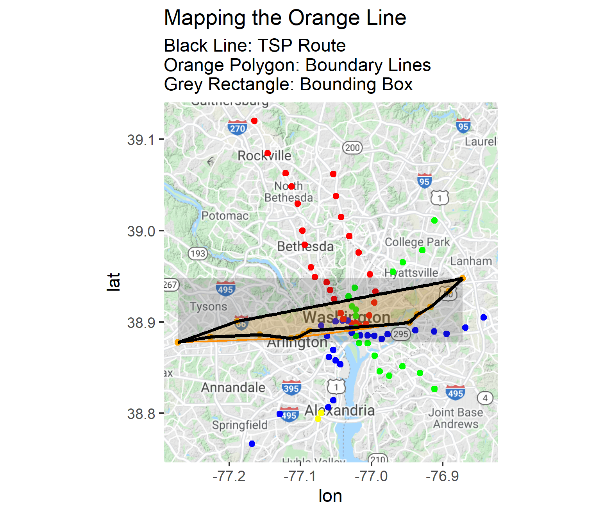
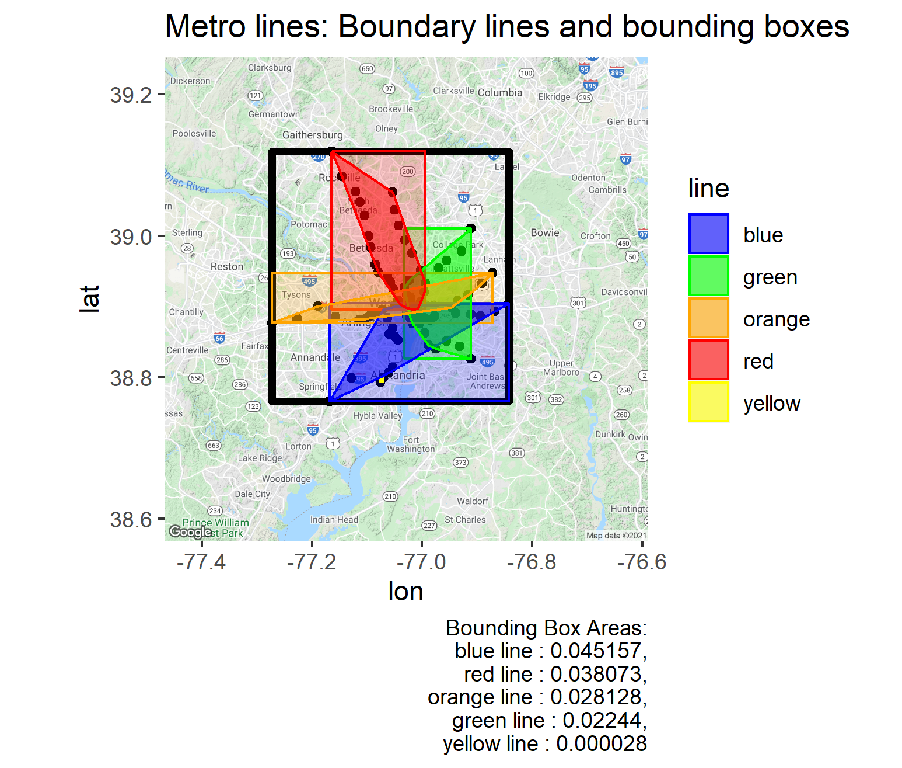

# Intro to Spatial Analysis
 Exploring bounding boxes and spatial analysis in R.
 Casual script(s?) as I learn fundamentals of spatial analysis. Troubleshooting and commentary in line with code.
 
 # April 5, 2020
 - Addressed the "Traveling Salesperson Problem" using the Orange Line
 - Plotted Bounding Box, Boundary Lines, and TSP Route on the same map for comparison

 # April 4, 2020
- Created boundary lines and bounding boxes for the entire metro system and each of the five metro lines.
- Generated a map using the Google Maps API and superimposed coordinates
- Color-coded the graph according to line color
- Generated areas for the bounding boxes (in caption)

Next steps: 
- Get areas for the space within the boundary lines
- Finish the intro to spatial analysis DataCamp course
- Merge datasets for analysis
